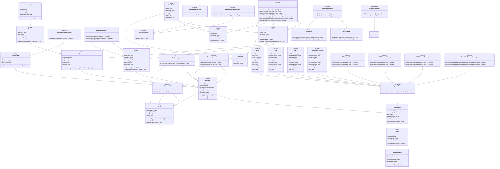

## Spring Boot Playground build with Github Action and Unit Test

```mermaid
classDiagram
  class User {
    <<Entity>>
    -userId: Long
    -username: String
    -password: String
    +getUserDetails(): String
    +changePassword(newPassword: String): void
  }

  class Customer {
    <<Entity>>
    -customerId: Long
    -firstName: String
    -lastName: String
    -email: String
    -address: String
    -dateOfBirth: Date
    +makeDeposit(amount: Double): void
    +makeWithdrawal(amount: Double): void
  }

  class Employee {
    <<Entity>>
    -employeeId: Long
    -firstName: String
    -lastName: String
    -position: String
    -hireDate: Date
    +processLoanApplication(loanApplication: LoanApplication): boolean
  }

  class Account {
    <<Entity>>
    -accountId: Long
    -balance: Double
    -accountType: AccountType
    -status: String
    -openedDate: Date
    -closedDate: Date
    +checkBalance(): Double
    +closeAccount(): void
  }

  class AccountType {
    <<Entity>>
    -typeId: Long
    -typeName: String
    -description: String
    +calculateInterest(account: Account): Double
  }

  class InterestCalculationService {
    <<Service>>
    +calculateInterest(account: Account): Double
  }

  class Transaction {
    <<Entity>>
    -transactionId: Long
    -amount: Double
    -date: Date
    -transactionType: String
    -description: String
    +getTransactionDetails(): String
  }

  class Card {
    <<Entity>>
    -cardNumber: String
    -expiryDate: Date
    -cardType: String
    -status: String
    +processPayment(amount: Double): boolean
    +blockCard(): void
    +requestReplacement(): void
  }

  class CardIssuingService {
    <<Service>>
    +issueCard(account: Account, cardType: String): Card
  }

  class RiskManagementService {
    <<Service>>
    +assessRisk(account: Account): String
    +blockAccount(account: Account): void
  }

  class ComplianceService {
    <<Service>>
    +performKYC(customer: Customer): boolean
    +performScreening(customer: Customer): boolean
    +generateReport(): String
  }

  class Permission {
    <<Entity>>
    -permissionId: Long
    -name: String
    -description: String
  }

  class IAMService {
    <<Service>>
    +createUser(userDetails: UserDetails): User
    +assignRole(user: User, role: Role): void
    +removeRole(user: User, role: Role): void
    +assignPermission(role: Role, permission: Permission): void
    +removePermission(role: Role, permission: Permission): void
    +authenticateUser(username: String, password: String): boolean
    +authorize(user: User, permission: String): boolean
  }

  class UserDetails {
    <<Entity>>
    -userId: Long
    -username: String
    -password: String
    -email: String
    -roles: List<Role>
    -permissions: List<Permission>
  }

  class Role {
    <<Entity>>
    -roleId: Long
    -roleName: String
    -description: String
    +getRoleDetails(): String
  }

  class SEPA {
    <<Entity>>
    -iban: String
    -bic: String
    -amount: Double
    -reference: String
    -date: Date
  }

  class FPS {
    <<Entity>>
    -sortCode: String
    -accountNumber: String
    -amount: Double
    -reference: String
    -date: Date
  }

  class SWIFT {
    <<Entity>>
    -swiftCode: String
    -accountNumber: String
    -amount: Double
    -reference: String
    -date: Date
  }

  class ProprietaryPayment {
    <<Entity>>
    -paymentMethod: String
    -accountNumber: String
    -amount: Double
    -reference: String
    -date: Date
  }

  class UserAuthenticationService {
    <<Service>>
    +authenticateUser(username: String, password: String): boolean
  }

  class AuthorizationService {
    <<Service>>
    +authorize(user: User): boolean
  }

  class Loan {
    <<Entity>>
    -loanId: Long
    -amount: Double
    -interestRate: Double
    -termInMonths: int
    +calculateRepayment(): Double
  }

  class LoanApplication {
    <<Entity>>
    -applicationId: Long
    -status: String
    -requestedAmount: Double
    -approvalDate: Date
    +getApplicationDetails(): String
  }

  class Bank {
    <<Entity>>
    -bankId: Long
    -name: String
    -location: String
    -establishedDate: Date
    +addBranch(branch: Branch): void
  }

  class Branch {
    <<Entity>>
    -branchId: Long
    -name: String
    -location: String
    -manager: Employee
    +assignManager(manager: Employee): void
  }

  class SecurityManager {
    <<Service>>
    +handleSecurity(): void
  }

  class AccountRepository {
    <<Repository>>
    +findById(accountId: Long): Optional<Account>
    +save(account: Account): Account
  }

  class NotificationService {
    <<Service>>
    +sendNotification(message: String): void
  }

  class EmailService {
    <<Service>>
    +sendEmail(email: String, message: String): void
  }

  class SMSService {
    <<Service>>
    +sendSMS(phoneNumber: String, message: String): void
  }

  class SEPAPaymentGateway {
    <<Service>>
    +processSEPA(paymentDetails: SEPA): boolean
  }

  class FPSPaymentGateway {
    <<Service>>
    +processFPS(paymentDetails: FPS): boolean
  }

  class SWIFTPaymentGateway {
    <<Service>>
    +processSWIFT(paymentDetails: SWIFT): boolean
  }

  class ProprietaryPaymentGateway {
    <<Service>>
    +processProprietaryPayment(paymentDetails: ProprietaryPayment): boolean
  }

  class FraudPreventionService {
    <<Service>>
    +detectCardFraud(card: Card): boolean
  }

  class PaymentGateway {
    <<Service>>
    +processPayment(transaction: Transaction): boolean
  }

  class SEPA {
    <<Entity>>
    -iban: String
    -bic: String
    -amount: Double
    -reference: String
    -date: Date
  }

  class FPS {
    <<Entity>>
    -sortCode: String
    -accountNumber: String
    -amount: Double
    -reference: String
    -date: Date
  }

  class SWIFT {
    <<Entity>>
    -swiftCode: String
    -accountNumber: String
    -amount: Double
    -reference: String
    -date: Date
  }

  class ProprietaryPayment {
    <<Entity>>
    -paymentMethod: String
    -accountNumber: String
    -amount: Double
    -reference: String
    -date: Date
  }

  class NotificationService {
    <<Service>>
    +sendNotification(message: String): void
  }

  class EmailService {
    <<Service>>
    +sendEmail(email: String, message: String): void
  }

  class SMSService {
    <<Service>>
    +sendSMS(phoneNumber: String, message: String): void
  }

  class SEPAPaymentGateway {
    <<Service>>
    +processSEPA(paymentDetails: SEPA): boolean
  }

  class FPSPaymentGateway {
    <<Service>>
    +processFPS(paymentDetails: FPS): boolean
  }

  class SWIFTPaymentGateway {
    <<Service>>
    +processSWIFT(paymentDetails: SWIFT): boolean
  }

  class ProprietaryPaymentGateway {
    <<Service>>
    +processProprietaryPayment(paymentDetails: ProprietaryPayment): boolean
  }

User <|-- Customer
User <|-- Employee

Customer --|> Account
Employee --|> Account
Account --|> Transaction
Account --|> Card
CardIssuingService --|> Account
RiskManagementService --|> Account
ComplianceService --|> Customer
PaymentGateway --|> Transaction
SEPAPaymentGateway --|> PaymentGateway
FPSPaymentGateway --|> PaymentGateway
SWIFTPaymentGateway --|> PaymentGateway
ProprietaryPaymentGateway --|> PaymentGateway
FraudPreventionService --|> Card
IAMService --|> User

Transaction --|> Loan
Loan --|> LoanApplication
Bank --|> Branch
Branch --|> Employee

AccountType --|> Account
InterestCalculationService --|> AccountType

CardIssuingService --|> Card
RiskManagementService --|> Account
ComplianceService --|> Customer

AccountRepository --|> JpaRepository

UserAuthenticationService --|> SecurityManager
AuthorizationService --|> SecurityManager

NotificationService --|> EmailService
NotificationService --|> SMSService

SEPA --|> PaymentGateway
FPS --|> PaymentGateway
SWIFT --|> PaymentGateway
ProprietaryPayment --|> PaymentGateway

FraudPreventionService --|> Card

IAMService --|> User
IAMService --|> Role
IAMService --|> Permission

UserDetails --|> User
UserDetails --|> Role
UserDetails --|> Permission

Role --|> Permission
```
